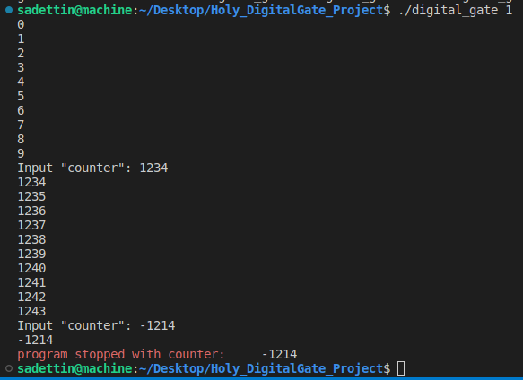
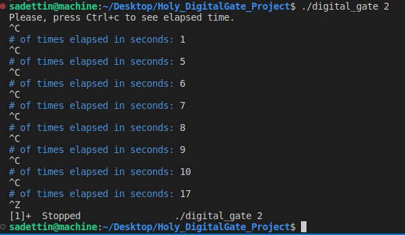
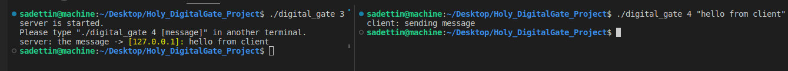
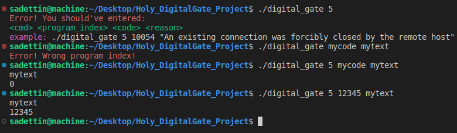
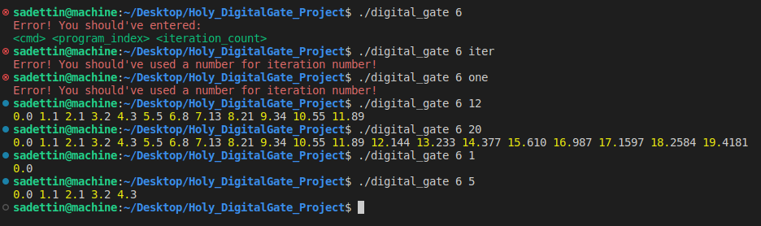

- This is my test for DigitalGate AMG

## Compile the project
```
make
make clean
```

## Run the project
```
./digital_gate [program index] [second argument] [third argument]
```
- Depending on the program index value, necessary arguments are different.
- If no necessity, my codes doesn't allow it.

## POSIX Threading

- Consist of two different threads
    - Consist of a global integer counter.
    - One thread should enter the following loop:
        - Sleep for a random interval between 1 to 1000 milliseconds
        - Print and increment the global counter
    - The other thread should:
        - Sleep for a random interval between 1 to 1000 milliseconds
        - Read an integer value from the stdin, and store it in the global counter

When working with threads in this section
- There were two threads running simultaneously. When the second thread prompted for an input by displaying the message ```Input "counter":```, however, before I could input anything, the first thread printed the counter on the terminal, which resulted in me being unable to provide the desired input.

#### run with
```
./digital_gate 1
```


## POSIX Signals
```
./digital_gate 2
```


## POSIX Socket


## Serialization
```
./digital_gate 5
```


## State Machines

