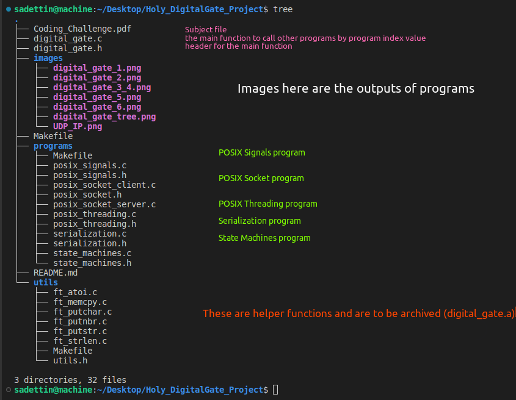

- This is my test for DigitalGate AMG



## Compile the project
```
make
make clean
```

## Run the project
```
./digital_gate [program index] [second argument] [third argument]
```
- Depending on the program index value, necessary arguments are different.
- If no necessity, my codes doesn't allow it.

## POSIX Threading

- Consist of two different threads
    - Consist of a global integer counter.
    - One thread should enter the following loop:
        - Sleep for a random interval between 1 to 1000 milliseconds
        - Print and increment the global counter
    - The other thread should:
        - Sleep for a random interval between 1 to 1000 milliseconds
        - Read an integer value from the stdin, and store it in the global counter
- I basically open a loop for both threads.

For the first thread, the loop only prints and incremenets the number as wanted.
```
while (1)
{
    ft_putnbr(g_counter++);
    ft_putchar('\n');
    usleep(10000);
}
```
The second cancels the first at first and takes input by asking some prompt and then starts the second thread again:
```
while (1)
{
    usleep(100000);
    pthread_cancel(g_thread1); // cancel the first thread
    line = readline("Input \"counter\": ");
    g_counter = ft_atoi(line);
    free(line);
    pthread_create(&g_thread1, NULL, ft_first_thread, NULL); // start the first thread
}
```

##### When working with threads in this section
- There were two threads running simultaneously. When the second thread prompted for an input by displaying the message ```Input "counter":```, however, before I could input anything, the first thread printed the counter on the terminal, which resulted in me being unable to provide the desired input.
(I just let the second thread cancel first one till I input)

#### run with
```
./digital_gate 1
```


## POSIX Signals

- Write a simple program that:
    - Sleeps for 1 second
    - Increments an integer counter

When Ctrl + c is pressed in the terminal, the number of seconds elapsed shall be printed and the program must continue counting without exiting.

- I just handled the SIGINT signal using ```sighandler_t signal(int signum, sighandler_t handler);``` function as assigning```signum = SIGINT```.
The main part that increases the counter every second, so that, it follows the time.
```
signal(SIGINT, ft_signal_handler); // start listening to SIGINT signal
while (1)
{
    sleep(1);
    g_counter++; // g_ prefix stands for "global"
}
```
With my function for signal handling I just printed the elapsed secons.
```
void	ft_signal_handler(int signal)
{
	(void)signal;
	ft_putstr("\n\033[34m# of times elapsed in seconds: \033[0m");
	ft_putnbr(g_counter);
	ft_putchar('\n');
}
```
```
./digital_gate 2
```


## POSIX Socket
- Write a simple program that: - Listens to incoming UDP packets and prints them along with their originating IP address
- Explain how you tested your app.
    - I tested it by having two main functions, one for client and the other for server. Then, I used send

Server side consists of four steps:
1. Creating socket,
2. Setup of port,adress,... 
3. Binding the socket to the specified address and port number
4. Waiting the signal
```
ft_putstr("server is started.\n");
ft_putstr("Please type \"./digital_gate 4\" in another terminal.\n");
sockfd = socket(AF_INET, SOCK_DGRAM, 0); // creating socket for server side
if (sockfd == -1)
{
    perror("server: failed to create socket");
    exit(EXIT_FAILURE);
}
servaddr.sin_family = AF_INET; // Setting the address family to IPv4
servaddr.sin_port = htons(12345); // Destionation Port
servaddr.sin_addr.s_addr = INADDR_ANY; // Destionation IP Adress (_ANY is for any avaliable)
rc = bind(sockfd, (const struct sockaddr *)&servaddr, sizeof(servaddr)); // 
if (rc == -1)
{
    perror("server: failed to bind");
    close(sockfd);
    exit(EXIT_FAILURE);
}
len = 0;
n = recvfrom(sockfd, (char *)buffer, 50, MSG_WAITALL, 0, &len); // receiving the signal
buffer[n] = '\n';
ft_putstr("server: the message -> ");
ft_putstr(buffer);
close(sockfd);
```
Client side consists of three steps:
1. Creating socket,
2. Setup of port,adress,...
3. Sending the signal
```
message = "hello from client";
sockfd = socket(AF_INET, SOCK_DGRAM, 0); // creating UDP socket for client side
if (sockfd == -1)
{
    perror("client: failed to create socket");
    exit(EXIT_FAILURE);
}
servaddr.sin_family = AF_INET; // Setting the address family to IPv4
servaddr.sin_port = htons(12345); // Destination port
servaddr.sin_addr.s_addr = INADDR_ANY; // Destionation IP Adress (_ANY is for any avaliable)
ft_putstr("client: sending message\n"); 
len = sendto(sockfd, (const char *)message, ft_strlen(message),
        0, (const struct sockaddr *)&servaddr, sizeof(servaddr)); // sending the message
if (len == -1)
    perror("client: failed to send");
close(sockfd);
```
```
./digital_gate 3
```
```
./digital_gate 4
```


## Serialization
```
typedef struct
{
    int Code;
    char * Reason;
} Crash;
```
such a C struct was given and I copied its content into ```char *buffer``` using C ``` void *memcpy(void *dest, const void *src, size_t n);``` function.
```
#define BUFFER_SIZE sizeof(Crash)

char	*buffer; // The data form that will be sent
Crash	crash; // The data form we can use

buffer = malloc(BUFFER_SIZE); // first, allocate enough space before copying
ft_memcpy(buffer, &crash, sizeof(crash)); // second, copy the content
crash = *(Crash *)buffer; // third, here we have the bake out of buffer
ft_putstr(crash.Reason); 
ft_putchar('\n');
ft_putnbr(crash.Code);
ft_putchar('\n');
free(buffer); // every enemy might deserve freedom
```
Description was:
- We need to send this data to another application with UDP sockets.
- Convert this object to a buffer that can be sent via UDP socket. 
NOTE: There is no need to actually send the data, the objective is to just construct the buffer so that it can be sent over the network.

```
./digital_gate 5 12345 package_1

```


## State Machines
- Create a simple C function, with the following signature, which every time it is called, returns the next entry in the Fibonacci sequence:
```unsigned long Next();```

For this, I coded a recursive fibonacci function such
```
unsigned long	ft_fib(unsigned long n)
{
	if (n < 2) // first two elements are 0 1
		return (n); // n is the same as 0 1
	return (ft_fib(n - 1) + ft_fib(n - 2)); // just the fibonacci here
}
```
To let it bring new entry in the sequence, I just used a static index variable ```static int    idx;```, so that, each time when I call my function, I increase the idx value and function saves it. 
```
unsigned long	Next()
{
	static int	idx;

	ft_putstr("\033[0;33m");
	ft_putnbr(idx);
	ft_putstr(".\033[0m");
	return (ft_fib(idx++));
}
```

